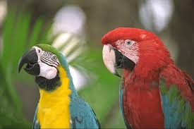
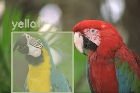
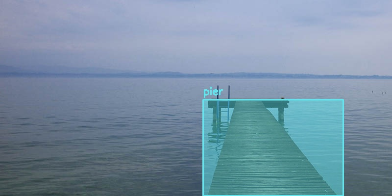

# PaliGemma Vision Language Model

A simplified and efficient implementation of Google's PaliGemma vision-language model for image understanding and object detection.


## 🚀 Features

- **Image Description**: Generate natural language descriptions of images
- **Object Detection**: Detect and visualize objects in images with bounding boxes
- **Interactive Mode**: Real-time conversation with images
- **Flexible Interface**: Both CLI and Python API support
- **Optimized Performance**: Simplified inference pipeline for better speed
- **Multi-device Support**: CUDA, MPS (Apple Silicon), and CPU compatibility

## 📸 Demo

### 🖼️ Image Description

<table>
<tr>
<td width="50%">

**City Skyline**


</td>
<td width="50%">

**Prompt:** `describe`

**Output:**
> A city skyline with a bridge over a river. The city is situated by the river, with the bridge connecting the city to a distant island. The sky is clear and blue, with a few white clouds. The bridge is long and red, with orange lights. There are boats on the river, and a large body of water lies behind the bridge. The city is lit up at night, with the skyscrapers being the most prominent feature.

</td>
</tr>

<tr>
<td width="50%">

**Colorful Parrots**


</td>
<td width="50%">

**Prompt:** `describe`

**Output:**
> Two vibrant parrots, a parrot with a yellow breast and a parrot with a red breast, stand side by side in a lush forest. Their colorful plumage and contrasting eyes create a captivating scene. The parrots' wings flutter with vibrant green feathers, while their beaks are adorned with black and white contrasting patches. The forest backdrop provides a serene setting for these feathered creatures, their heads bobbing in rhythm with the breeze.

</td>
</tr>

<tr>
<td width="50%">

**Peaceful Lake**


</td>
<td width="50%">

**Prompt:** `describe`

**Output:**
> A wooden pier extends gracefully into a tranquil body of water, its surface reflecting the cloudy sky above. The pier is adorned with a post and a thin metal post, while the water mirrors the sky in its stillness. The water is calm and blue, mirroring the clear blue sky above the land, which is shrouded in clouds. The pier is a long brown wooden walkway over the water, connecting it to a distant shore. The water between the pier and the shore is calm and flat, creating a serene atmosphere.

</td>
</tr>
</table>

---

### 🎯 Object Detection with Visualization

<table>
<tr>
<td width="33%">

**Input**

*Original Image*

</td>
<td width="33%">

**Detection**
`detect car`

**Result:**
`<loc0246><loc0229><loc0872><loc0904> car<eos>`

</td>
<td width="33%">

**Output**

*Detected with bounding box*

</td>
</tr>

<tr>
<td width="33%">

**Input**

*Original Image*

</td>
<td width="33%">

**Detection**
`detect yellow breast parrot`

**Result:**
`<loc0354><loc0086><loc1023><loc0533> yellow breast parrot<eos>`

</td>
<td width="33%">

**Output**

*Detected with bounding box*

<tr>
<td width="33%">

**Input**

*Original Image*

</td>
<td width="33%">

**Detection**
`detect pier`

**Result:**
`<loc0520><loc0531><loc1022><loc0896> pier<eos>`

</td>
<td width="33%">

**Output**

*Detected with bounding box*

</td>
</tr>
</table>

---

### 💬 Interactive Mode

Start an interactive session for real-time image analysis:

```bash
python inference.py

# Example session:
>>> /image examples/tiger.jpg
>>> describe
[Output] In this image we can see a tiger...

>>> detect tiger  
[Detection] Showing detection results...
>>> exit
```

**Available Commands:**
- `describe` - Generate image description
- `detect <object>` - Find and highlight objects
- `/image <path>` - Switch to different image
- `/temperature <value>` - Adjust creativity (0.1-2.0)
- `/help` - Show all commands

## 🛠️ Installation

### Prerequisites
- Python 3.8+
- CUDA-compatible GPU (optional, but recommended)
- 8GB+ RAM

### Quick Start
```bash
# Clone the repository
git clone https://github.com/jarviszhang24/nano-paligemma2.git
cd nano-paligemma2

# Create conda environment
conda create -n paligemma python=3.9
conda activate paligemma

# Install dependencies
pip install -r requirements.txt

# Download model weights (will be prompted on first run)
python inference.py --help
```

## 📖 Usage

### Command Line Interface

#### Image Description
```bash
# Simple description
python paligemma.py describe path/to/image.jpg

# Detailed description  
python paligemma.py describe path/to/image.jpg --detail
```

#### Object Detection
```bash
# Detect specific object
python paligemma.py detect path/to/image.jpg "car"

# Multiple objects
python paligemma.py detect path/to/image.jpg "person"
```

#### Direct Inference
```bash
python paligemma.py -i path/to/image.jpg -p "your custom prompt"
```

### Interactive Mode
```bash
python inference.py

# Available commands in interactive mode:
# /image <path>        - Change current image
# /temperature <val>   - Adjust generation temperature  
# /top_p <val>         - Adjust top-p sampling
# /help                - Show help
# exit                 - Quit
```

### Python API
```python
from inference import SimpleInference

# Initialize model
engine = SimpleInference()

# Generate description
engine.generate(
    image_path="examples/car.png",
    prompt="describe this image",
    max_tokens=1024,
    temperature=0.8
)

# Object detection with visualization
engine.generate(
    image_path="examples/car.png", 
    prompt="detect car",
    detection=True
)
```

## 🏗️ Project Structure

```
PaliGemma-Vision-Language-Model/
├── inference.py           # Main inference engine
├── paligemma.py          # Command-line interface
├── requirements.txt      # Dependencies
├── src/                  # Core modules
│   ├── processor.py      # Text/image processing
│   ├── kv_cache.py      # Key-value caching
│   ├── generation.py    # Text generation utilities
│   ├── detection.py     # Object detection & visualization
│   ├── attention/       # Attention mechanisms
│   ├── text/           # Text processing components
│   └── vision/         # Vision processing components
├── scripts/            # Utility scripts
│   └── download_weights.py
├── examples/           # Sample images
└── configs/           # Configuration files
```

## ⚡ Performance

| Device | Tokens/sec | Memory Usage |
|--------|------------|--------------|
| Apple M4 Pro | ~4-6 | 20GB RAM |


*Benchmarked on PaliGemma2-3B model with 224px images*

## 🔧 Configuration

### Model Selection
Currently supports PaliGemma2-3B (default). Model path can be configured:
```bash
python inference.py --model path/to/your/model
```

### Generation Parameters
- `temperature`: Controls randomness (0.1-2.0, default: 0.8)
- `top_p`: Nucleus sampling parameter (0.1-1.0, default: 0.9)  
- `max_tokens`: Maximum tokens to generate (default: 1024)

## 🤝 Contributing

Contributions are welcome! Please feel free to submit a Pull Request.

1. Fork the project
2. Create your feature branch (`git checkout -b feature/AmazingFeature`)
3. Commit your changes (`git commit -m 'Add some AmazingFeature'`)
4. Push to the branch (`git push origin feature/AmazingFeature`)
5. Open a Pull Request

## 📝 License

This project is licensed under the MIT License - see the [LICENSE](LICENSE) file for details.

## 🙏 Acknowledgments

- Google Research for the original PaliGemma model
- Hugging Face for the transformers library
- The open-source AI community

## 📧 Contact


---

**⭐ If this project helped you, please consider giving it a star!**